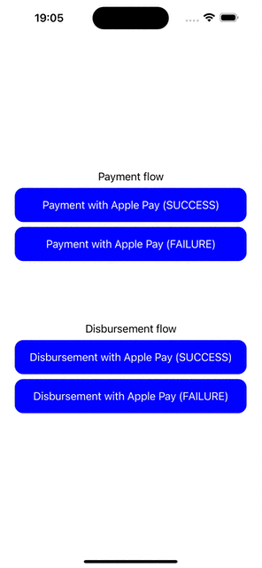

# react-native-apple-pay

[](https://github.com/facebook/react-native/releases/tag/v0.41.0)

[](https://github.com/busfor/react-native-apple-pay/tree/master)

Accept Payments and Disbursements with Apple Pay for React Native apps.

<div>



</div>
---

## Getting started

`$ yarn add react-native-apple-pay`

## Linking

### >= 0.60

Autolinking will just do the job.

### < 0.60

### Mostly automatic installation

`$ react-native link react-native-apple-pay`

### CocoaPods

Link using [Cocoapods](https://cocoapods.org) by adding this to your `Podfile`:

```ruby
pod 'RNApplePay', :path => '../node_modules/react-native-apple-pay'
```

### Manual installation

#### iOS

1. In XCode, in the project navigator, right click `Libraries` ➜ `Add Files to [your project's name]`
2. Go to `node_modules` ➜ `react-native-apple-pay` and add `RNApplePay.xcodeproj`
3. In XCode, in the project navigator, select your project. Add `libRNApplePay.a` to your project's `Build Phases` ➜ `Link Binary With Libraries`
4. Run your project (`Cmd+R`)<

## Usage

```javascript
import { ApplePay, ApplePayRequestStatus } from "react-native-apple-pay";

const payWithApplePay = async () => {
  // Check if ApplePay is available
  if (!ApplePay.canMakePayments) {
    return;
  }

  try {
    const { cardType, displayName, network, paymentData, transactionId } =
      await ApplePay.requestPayment({
        merchantIdentifier: "merchant.com.example",
        merchantCapabilities: ["3ds", "debit"],
        supportedNetworks: ["mastercard", "visa"],
        countryCode: "US",
        currencyCode: "USD",
        paymentSummaryItems: [
          {
            label: "Item label",
            amount: "100.00",
          },
        ],
      });

    console.log("requestPayment response:", {
      cardType,
      displayName,
      network,
      paymentData,
      transactionId,
    });

    setTimeout(async () => {
      try {
        await ApplePay.complete(ApplePayRequestStatus.succes);

        console.log("complete");
      } catch (error) {
        console.log("complete error:", { error });
      }
    }, 1000);
  } catch (error) {
    console.log("requestPayment error:", { error });

    if (error.code === ApplePayRequestStatus.dismissed) {
      console.log("requestPayment dismissed");
    }

    if (error.code === ApplePayRequestStatus.requestError) {
      console.log("requestPayment requestError:", error.message);
    }
  }
};
```

## Demo

You can run the demo by cloning the project and running:

`$ yarn demo:install # To install depencies and build the app`

`$ yarn demo:start # To run react-native`
